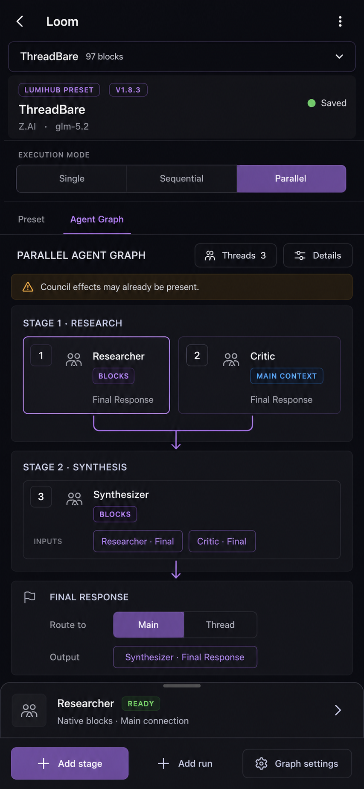
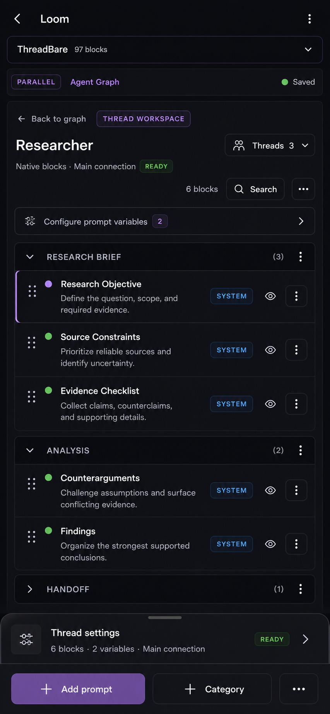
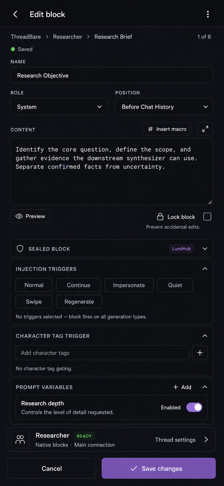
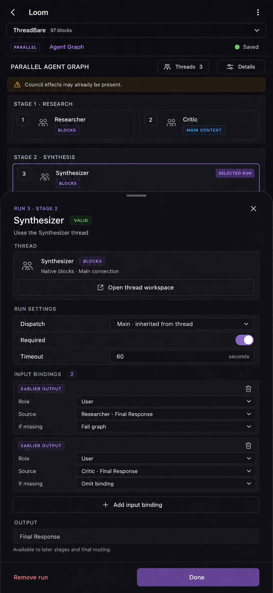
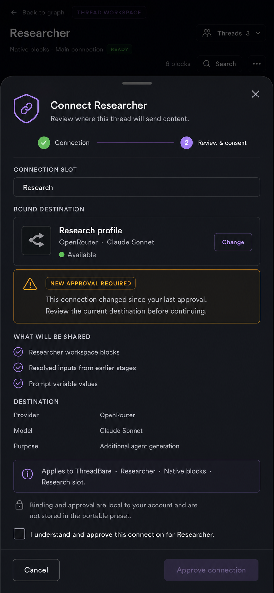
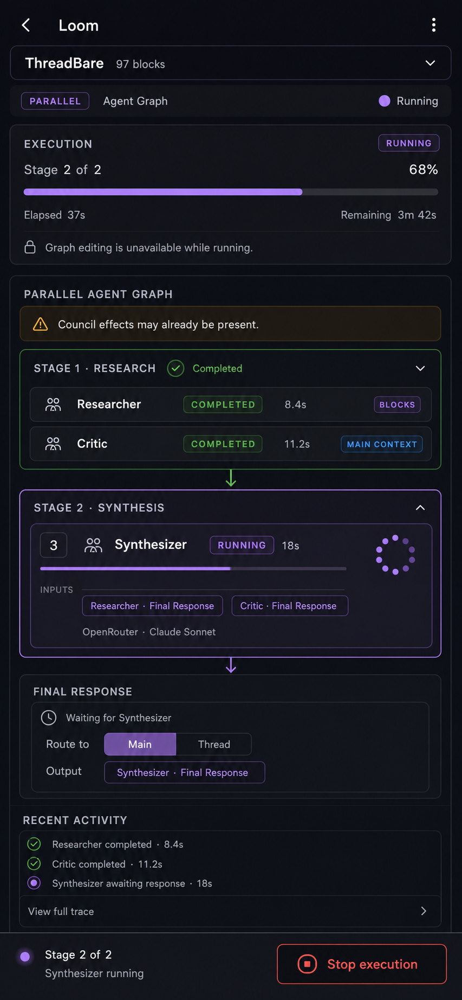
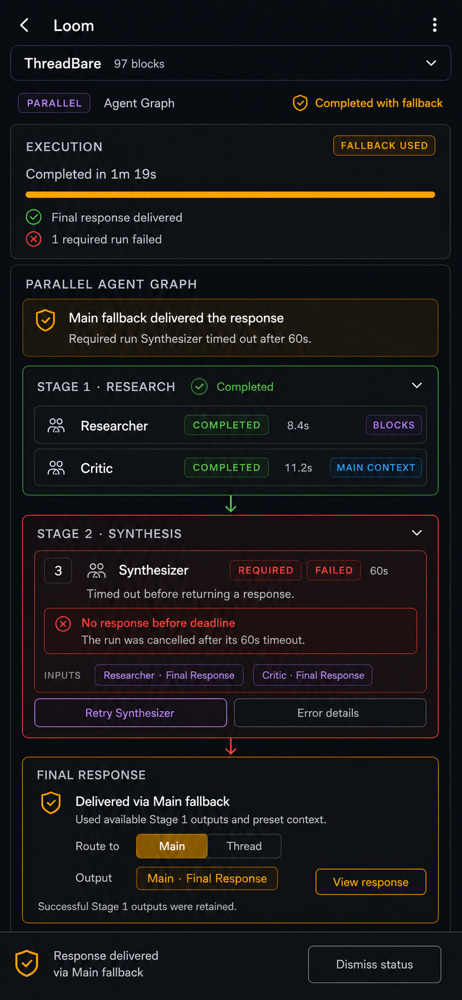
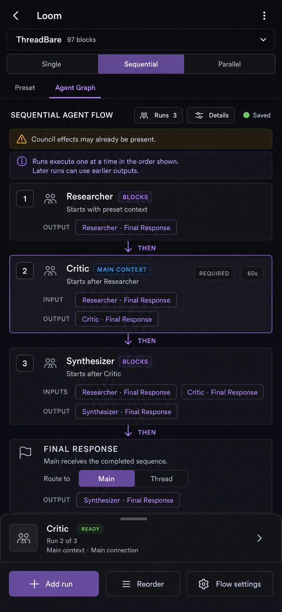
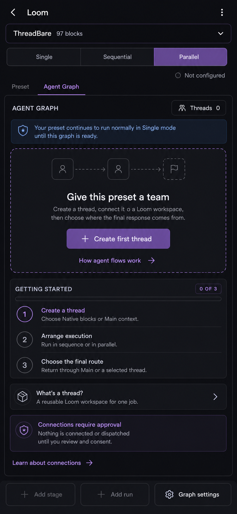

# Agentic Preset Composer Mobile UI Guidance

> **Status:** Responsive supplement to [`UI.md`](./UI.md). This document covers mobile composition, touch interaction, responsive graph presentation, bottom sheets, safe areas, and narrow-screen accessibility. [`DESIGN.md`](./DESIGN.md) remains authoritative for product, runtime, privacy, failure, and security behavior; `UI.md` remains authoritative for the shared frontend and interaction contract.

> The mobile mockups in [`docs/ui-targets/mobile/`](./docs/ui-targets/mobile/) are final responsive composition and visual-state targets for portrait phone-sized surfaces. Match their navigation, drawers, sheets, persistent actions, hierarchy, and visible states while using host breakpoints, components, tokens, controlled surfaces, localization, and accessibility behavior instead of hard-coded screenshot dimensions.

## Scope and authority

APC is one responsive product. Mobile must not introduce a second graph model, editor, persistence path, consent flow, execution lifecycle, or vocabulary.

Use this authority order when guidance or a mockup appears to disagree:

1. `DESIGN.md` defines canonical product and runtime behavior.
2. `UI.md` defines canonical frontend behavior and cross-viewport interaction.
3. `UI-Mobile.md` defines responsive presentation of that behavior.
4. Mockups define the required visual hierarchy, composition, controls, and states, subject only to the explicit behavioral exceptions above.

The example preset, thread names, providers, models, timings, outputs, and prompt content are illustrative. They are not defaults or required fixtures.

Two mockup details require explicit caution:

- The failure target includes a **Retry Synthesizer** affordance for visual context. Manual retry is not authorized V1 behavior. Follow `UI.md` and expose only actions in the closed runtime contract.
- The first-use target uses one generic **Create first thread** button. Canonical first use still requires separate **Create Sequential graph** and **Create Parallel graph** actions with the behavior defined in `UI.md`.

## Responsive model

### Preserve semantic order

Desktop uses threads or run order on the left, the primary graph or workspace in the center, and selected-object detail on the right. Mobile preserves that meaning in this order:

1. Preset and mode context.
2. Primary graph, workspace, editor, consent, or runtime task.
3. Selected-object detail in a drawer, sheet, disclosure, or dedicated controlled-editor route.
4. Persistent actions, when needed, above the device safe area.

Do not shrink the desktop three-pane layout into three narrow columns. Do not require horizontal page scrolling to understand graph order, dependencies, outcomes, or the final route.

### Shell and navigation

- Keep the host back action, Loom identity, preset selector, and overflow behavior consistent with the surrounding mobile editor.
- Preserve **Single | Sequential | Parallel** as one accessible radiogroup. The full set remains available to assistive technology and visible when the host layout permits; a compact runtime summary in a mockup is not permission to remove the canonical choices.
- Keep **Preset** and **Agent Graph** navigation adjacent to the mode context.
- Avoid stacking multiple permanently sticky headers. The graph or editor needs useful vertical space after host safe areas and navigation are accounted for.
- Returning from a thread workspace, controlled block editor, inspector sheet, consent sheet, or trace view must restore graph selection and focus.

### Mobile surface patterns

| Purpose | Mobile presentation | Interaction contract |
| --- | --- | --- |
| Selected thread or run summary | Non-blocking bottom drawer | Graph remains visible and interactive; expand or dismiss without losing selection. |
| Run configuration | Expanded bottom sheet or host-equivalent detail surface | Body scrolls independently; destructive and completion actions remain separated and reachable. |
| Controlled block editing | Dedicated host-controlled editor route | Preserve host fields, validation, keyboard behavior, macros, variables, save, and return state. |
| Connection consent | Blocking near-full-height review sheet | Background is inert; disclosure precedes acknowledgment; approval remains disabled until acknowledged. |
| Trace or error detail | Bounded disclosure or sheet | Start with human-readable summary; never default to raw diagnostics or sensitive identifiers. |

Sheets must provide an accessible name, a predictable close or back action, focus containment when modal, focus restoration on close, and enough bottom padding for the fixed footer and device safe area. Swipe-to-dismiss may supplement but never replace an explicit accessible control.

### Graph adaptation

- Verticalize ordered stages and sequential runs. Use connector lines and text such as **THEN** where spatial order alone is insufficient.
- A Parallel stage may use two compact columns only when names, statuses, roles, and output bindings remain readable at supported zoom and with long translations. Otherwise stack its runs.
- Keep stage boundaries visible. A narrow screen must not make separate stages look like one undifferentiated list.
- Keep the final route in the graph flow. Do not move it into unrelated global settings on mobile.
- Use the selected run or thread drawer for context that occupied the desktop inspector; do not duplicate the entire inspector beneath every graph card.
- Reordering needs explicit Move or Reorder controls and keyboard equivalents. Drag handles are supplementary.

### Persistent actions and safe areas

- Use a fixed bottom action bar only for actions that must remain reachable during the current task.
- Add scroll padding equal to the action bar height so the last card or field is never covered.
- Respect `safe-area-inset-bottom` or the host equivalent.
- Keep destructive actions visually and spatially distinct from primary completion actions.
- While execution is active, replace graph mutation actions with runtime status and Stop. After settlement, remove Stop and present only actions valid for the winning outcome.
- Do not duplicate the same primary call to action in both content and the footer unless the host pattern explicitly requires it.

### Touch, text, and accessibility

- Use host-supported touch targets, with a 44 by 44 CSS-pixel minimum when the host does not define a larger target.
- Never rely on color, animation, swipe gestures, or card position alone. Pair status with text and an icon or shape.
- Allow labels, warnings, provider/model descriptions, thread names, and translated strings to wrap. Preserve full text for safety guarantees, consent disclosures, failure causes, and delivered outcomes.
- Do not encode critical meaning only in truncated chips. Provide an accessible full label when space requires visual truncation.
- Keep logical headings and reading order aligned with the visual single-column flow.
- Announce mode changes, graph mutations, consent state, execution progress, cancellation, and settlement through the shared live-region contract without duplicate announcements.
- Respect reduced motion for progress shimmer, spinners, connector animation, drawer transitions, and sheet transitions.
- Opening the mobile keyboard must not hide the active field, validation error, or Save action.

## Design targets

### 1. Parallel graph overview

The overview keeps mode, graph, ordered stages, selected thread context, and graph actions in one vertical composition.

Implementation guidance:

- Keep the conservative Council warning visible for every non-Single graph.
- Preserve stage grouping and earlier-output bindings when cards stack or reflow.
- Use the bottom drawer for the selected thread summary; expanding it reveals configuration without replacing the graph.
- If two runs share a row, reflow to one column before text, status, output, or touch targets become ambiguous.
- Keep **Add stage**, **Add run**, and graph settings above the safe area and disable them with reasons when bounds or validation prevent the action.

### 2. Thread workspace and block management

The thread workspace remains recognizably Loom while preserving the selected thread and a direct route back to the graph.

Implementation guidance:

- Use the host-controlled block-management surface. Do not recreate block categories, preview, ordering, enablement, variables, or edit behavior.
- Keep thread identity, workspace source, connection summary, and readiness near the workspace heading.
- Move lower-frequency row actions into an accessible overflow menu when they cannot remain legible inline.
- Preserve an explicit Search action and expose its active state and result count accessibly.
- Use the bottom drawer for thread settings and keep Add prompt or category actions above the safe area.
- A `main-context` thread remains read-only and does not present a second editable copy of Main blocks.

### 3. Controlled block editor

Block editing uses a focused route because the form and content editor need the full narrow viewport.

Implementation guidance:

- Keep the host-controlled editor authoritative and preserve the thread breadcrumb or equivalent return context.
- Stack fields in semantic order. Related compact fields may share a row only when translation and zoom remain usable.
- Allow the content editor to grow, but keep macro insertion, preview, validation, and expanded editing reachable.
- Collapse advanced host sections into accessible disclosures without changing their values or validation behavior.
- Keep Cancel and Save persistent when the host pattern supports it; ensure the keyboard cannot cover Save.
- Successful save returns to the same thread workspace and restores the edited block's position and focus.

### 4. Selected-run configuration

The selected graph card remains visible above an expanded run sheet so the user retains topology while configuring one scheduled use.

Implementation guidance:

- Distinguish the reusable thread summary from run-owned stage position, requiredness, timeout, bindings, missing-output policy, and message role.
- Keep one earlier-output binding per readable card or disclosure. Do not compress multiple source, role, and policy controls into a dense table.
- Only earlier-stage outputs may be offered as sources.
- Keep Remove run separate from Done and require the canonical confirmation when removal affects bindings or the final route.
- Sheet close or completion preserves the selected run and graph scroll position.

### 5. Connection review and consent

Consent becomes a blocking, near-full-height review sheet rather than a small desktop dialog.

Implementation guidance:

- Keep connection slot, resolved destination, changed-approval warning, disclosure, scope, local-storage note, and acknowledgment in one uninterrupted reading flow.
- The sheet body may scroll, but the acknowledgment must precede approval in reading and focus order.
- Keep Cancel and the disabled-until-acknowledged approval action in a persistent footer.
- Make the obscured graph inert and unavailable to assistive technology while the modal is open.
- Never expose connection UUIDs, dispatch revisions, receipts, nonces, or other internal consent dimensions.
- Dismissal leaves the graph editable and dispatch blocked as defined by `UI.md` and `DESIGN.md`.

### 6. Live graph execution

Runtime remains a graph-editor state: global progress comes first, completed work compresses, and the active run receives the strongest emphasis.

Implementation guidance:

- Keep the graph visible and lock mutation while active. Do not replace it with a separate runtime console.
- Summarize completed runs without hiding their stage membership or status.
- Expand the active run with authoritative timing, dispatch description, bounded progress, and input context where available.
- Keep the final route visibly waiting until settlement; never imply delivery from optimistic progress.
- Pin the runtime summary and Stop action above the safe area. Stop must use the graph cancellation contract and must not imply rollback.
- Full trace is progressive disclosure and remains bounded and sanitized.

### 7. Required failure and Main Graph-fallback

The mobile result separates the localized failed run from the winning delivered outcome.

Implementation guidance:

- Keep the failed required run red, retained earlier successes green, and the overall delivered Main Graph-fallback amber.
- State the failed run, typed cause, and delivered route in plain language.
- Keep bounded error details adjacent to the failed run and response viewing adjacent to the delivered fallback.
- Do **not** implement the mockup's Retry action in V1. Manual retry remains a non-goal unless the canonical contract is explicitly expanded.
- After settlement, remove Stop and graph-editing locks. A compact dismissible outcome bar may persist without obscuring the final route.
- Preserve the canonical outcome priority and never color Graph-fallback as ordinary success.

### 8. Sequential mode

Sequential mode reads as one numbered top-to-bottom causal chain. The visible order maps to exactly one run per ordered stage.

Implementation guidance:

- Use clear connectors and **THEN** labels so stage order remains understandable without a desktop run-order pane.
- Show each run's starting point, earlier-output inputs, and single final output.
- The selected-run drawer replaces the desktop detail pane and preserves the chain above it.
- Reorder operates on ordered stages while preserving thread workspace identity and explaining any binding impact.
- Sequential calls use authoritative Main dispatch; do not expose explicit per-thread connection-slot overrides.
- Keep final routing at the end of the visible chain.

### 9. First-use and empty state

First use keeps the safe Single-mode guarantee visible, teaches the three-step graph model, and reveals connection approval before dispatch.

Implementation guidance:

- Present the guarantee that the preset continues through native Single behavior until a valid graph is ready.
- Follow the canonical `UI.md` contract and provide two explicit primary actions: **Create Sequential graph** and **Create Parallel graph**. The mockup's generic **Create first thread** label is not literal implementation guidance.
- Explain the concepts in order: create a thread, arrange execution, choose the final route.
- Use progressive disclosure for deeper thread and connection explanations.
- Keep unavailable Add stage or Add run actions visible but disabled with reasons.
- Never create a sample graph, choose a connection, grant consent, or dispatch without explicit user action.

## Responsive verification

Verify the mobile implementation against host-supported narrow widths, landscape, zoom, long translations, reduced motion, keyboard-only navigation, screen readers, and the on-screen keyboard.

At minimum, test:

- Mode switching and rollback with all three choices present.
- Graph cards reflowing from two columns to one without losing stage or binding meaning.
- Drawer and sheet focus containment, restoration, and scroll padding.
- Controlled block editing with the keyboard open and Save reachable.
- Consent disclosure and acknowledgment with long destination descriptions.
- Runtime Stop placement, cancellation announcements, and no implied rollback.
- Localized required failure versus the amber delivered Graph-fallback outcome.
- Sequential reordering and accessible alternatives to drag-and-drop.
- First-use creation with separate Sequential and Parallel actions.
- Host permission loss, disable, teardown, and remount without stale mobile drawers, sheets, selections, or consent data.

The mobile UI is complete only when it preserves the same authority, safety, and outcome clarity as the desktop contract while remaining usable without horizontal scrolling or hidden critical actions.
