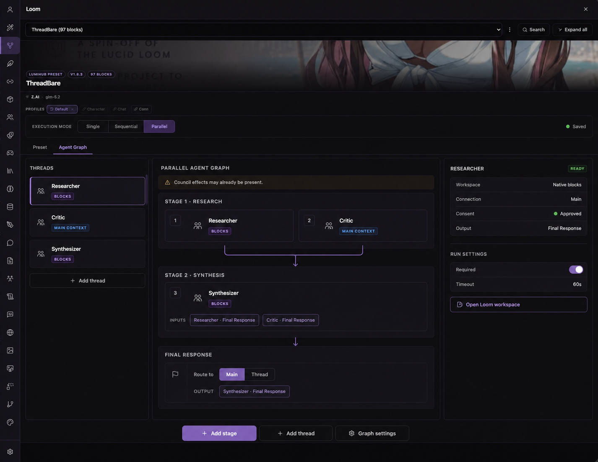
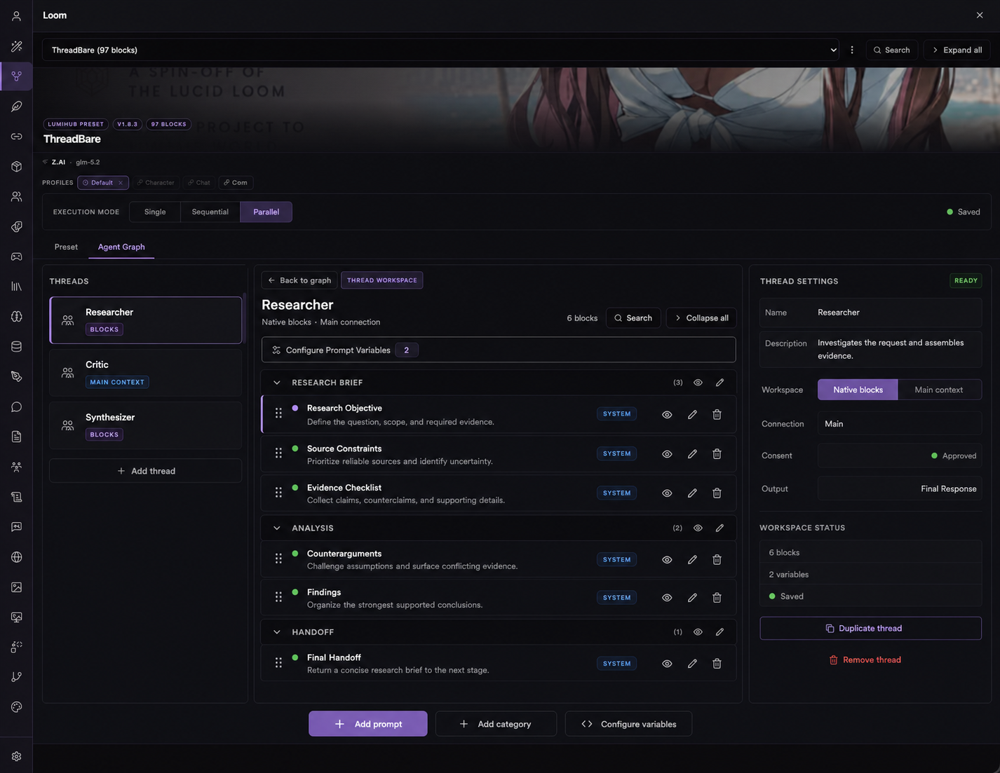
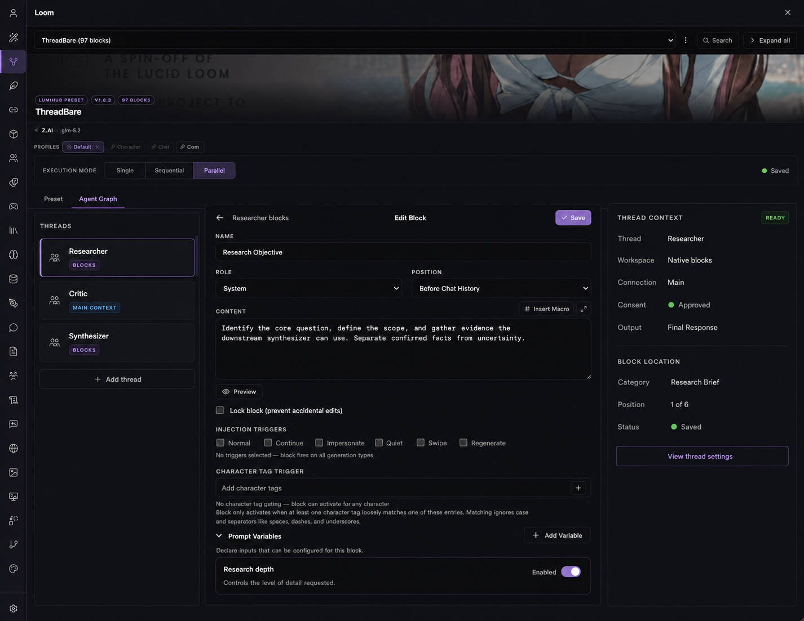
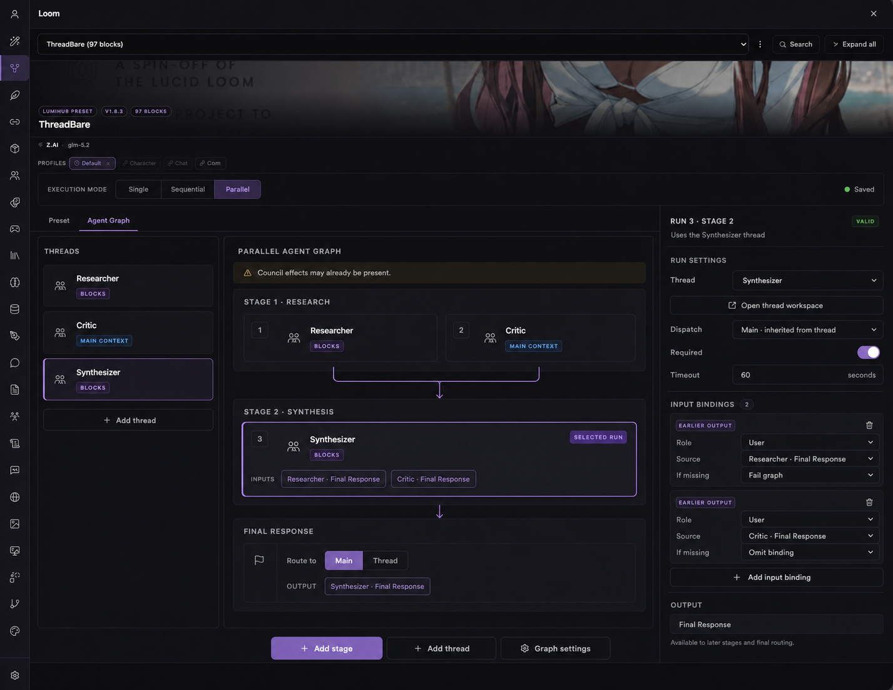
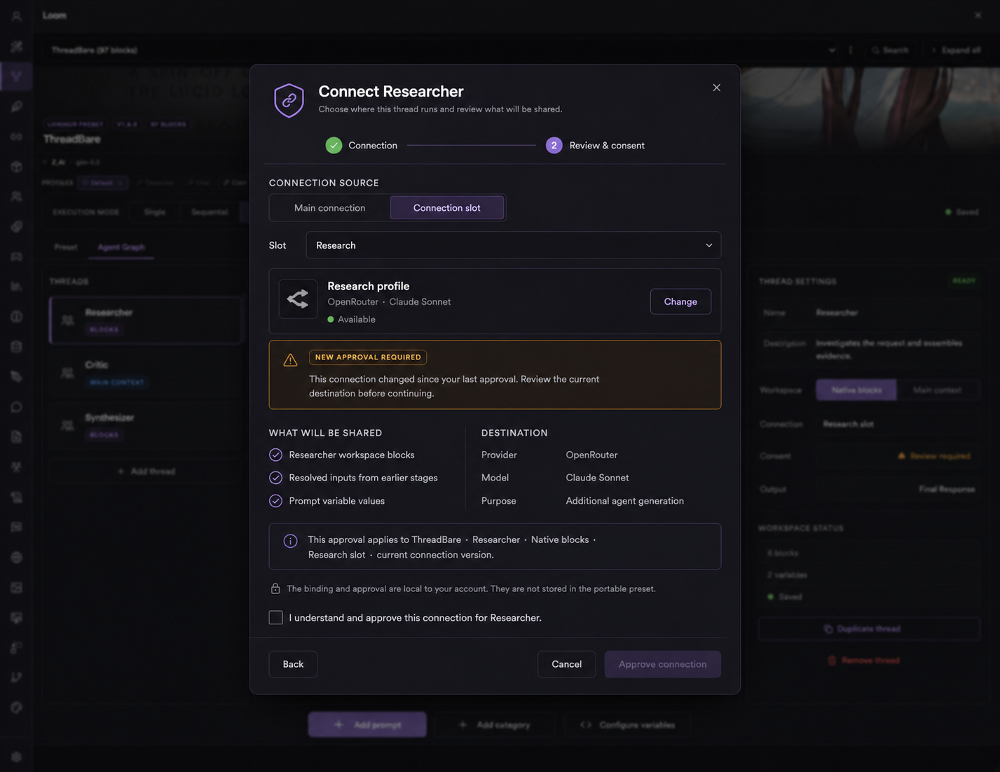
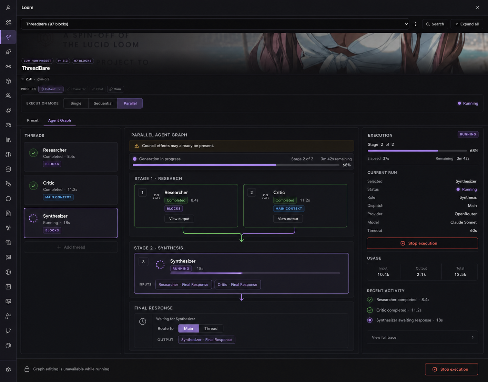
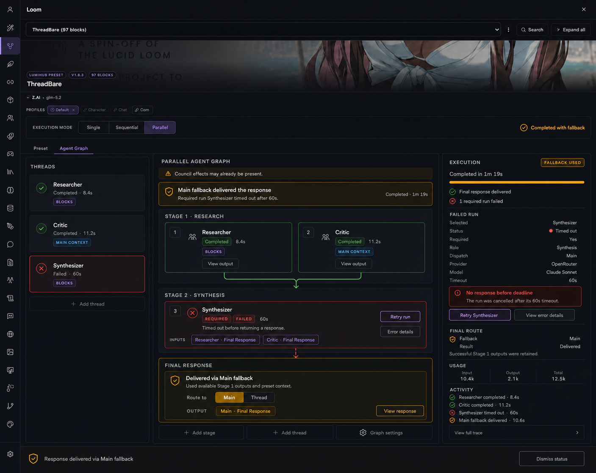
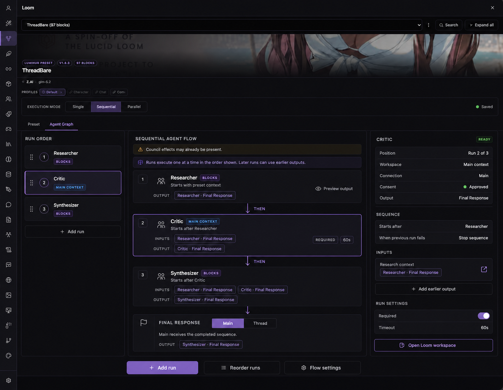
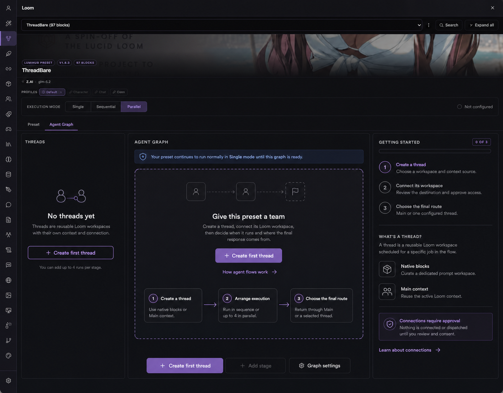

# Agentic Preset Composer UI Guidance

> **Status:** Current implementation guidance for the APC frontend. This document covers presentation, interaction, accessibility, and information architecture; [`DESIGN.md`](./DESIGN.md) remains authoritative for product, runtime, privacy, failure, and security behavior.

> APC currently registers its mode toolbar and Agent Graph tab through the host's generic roots, owns the graph/thread/inspector surfaces, and uses the host lifecycle for permission, locale, persistence, and teardown. Incompatible descriptors fail before these contributions mount.

## Purpose

APC should feel like a native extension of Lumiverse's Loom editor: the user remains inside the preset they already understand, but gains a clear way to divide work among reusable thread workspaces, arrange bounded execution, inspect what happened, and control the final response.

The mockups in [`docs/ui-targets/`](./docs/ui-targets/) and [`docs/ui-targets/mobile/`](./docs/ui-targets/mobile/) are final composition and visual-state targets. Match their information hierarchy, views, controls, navigation, and status presentation while reusing host components, tokens, responsive breakpoints, and controlled editor surfaces rather than hard-coding screenshot pixels. `DESIGN.md`, this document, and `UI-Mobile.md` govern behavior and the explicit exceptions they name; do not silently omit or reinterpret an observable target.

The example preset name (`ThreadBare`), thread names (`Researcher`, `Critic`, `Synthesizer`), providers, models, timings, token counts, and prompt content are illustrative only. They are not defaults or fixtures required by the product.

The current frontend is implementation material as well as the UI contract. Keep
host-owned authority and lifecycle boundaries intact; do not preserve duplicate
controls, raw identifiers, or stale views when the implementation has a
single current path.

## Product stance

The interface should make five ideas obvious:

1. **Single remains safe and familiar.** A preset without a valid non-Single graph continues through native Loom behavior.
2. **A thread is a reusable workspace; a run is one scheduled use of it.** Never collapse these into one object in UI copy or state handling.
3. **The graph is bounded and stage-ordered.** APC is not a freeform automation canvas.
4. **Connections and dispatch are explicit.** Users review where content is going before any subcall is made.
5. **One user-facing outcome wins.** Success, local optional failure, Graph-fallback, selected-final failure, cancellation, and integrity-fatal outcomes must not compete onscreen.

Prefer progressive disclosure. The graph should explain structure and current state at a glance; inspectors, controlled editors, consent surfaces, and trace details reveal depth when selected.

## Canonical vocabulary

Use these terms consistently in UI copy, accessibility labels, tests, and locale catalogs.

| Term | Meaning |
| --- | --- |
| **Main** | The fixed live Loom thread. It owns the top-level preset blocks, variables, authoritative Main dispatch, and normal user-facing generation path. |
| **Thread** | A reusable APC workspace using either native Loom blocks or cloned Main context. |
| **Run** | One use of a thread in one stage. A thread may be reused in later stages, but cannot run twice in the same stage. |
| **Stage** | An ordered execution boundary. References may target earlier stages only. |
| **Output** | A run's single `final` output. Synthesis and voting are ordinary downstream runs, never implicit operations. |
| **Final route** | Either Main or one designated thread run. Both are first-class routes when the required host capability and permission are available. |
| **Workspace** | The context source used by a thread: `native-blocks` or `main-context`. |
| **Connection** | The provider destination resolved from inherited Main or an explicit local connection slot. Connection UUIDs never belong in portable graph metadata or user-facing copy. |
| **Consent** | Approval bound to the exact preset, thread, workspace source, connection source, destination, effective dispatch revision, installation, and disclosure version. |

## Canonical bounds

The editor must make invalid capacity and schedule states difficult to create and easy to explain. Canonical limits come from the schema and `DESIGN.md`; do not duplicate them as unrelated UI constants.

- At most 16 threads, 32 stages, and 64 runs in a preset.
- Parallel stages contain at most four distinct runs.
- Sequential stages contain exactly one run.
- A run timeout is at most 240 seconds.
- APC work fits inside the host-bound 285-second graph budget; estimated schedule cost is based on ordered stage maxima, not the sum of every parallel run.
- References target earlier stages only. Cycles, same-stage references, unreachable runs, invalid required/failure-policy closure, and an invalid final route make the affected non-Single mode unavailable.

## Placement and information architecture

Core owns the generic host roots. APC registers two contributions through them and owns only APC-specific rendering, copy, disabled reasons, and accessibility behavior:

- A toolbar radiogroup above LoomBuilder's list/edit branch: **Single | Sequential | Parallel**.
- A preset-editor tab labeled **Agent Graph** for valid non-Single modes.

Selecting **Single** returns the user to the host's built-in **Preset** editor. Selecting a valid non-Single mode mounts APC's Agent Graph view. Keep all three mode choices visible; unsupported, invalid, unresolved, or permission-blocked choices remain visible but disabled with an APC-owned reason.

At desktop widths, use a stable three-pane workspace:

- **Left:** threads or run order; selection and high-level status.
- **Center:** graph topology, thread workspace, or primary task content.
- **Right:** selected-object configuration, consent summary, or execution inspector.

Do not send users to a separate diagnostics application during execution. Preserve the graph's spatial model and transform it into a runtime state. On narrower surfaces, follow host responsive patterns and preserve this semantic order; do not shrink three dense columns into illegibility.

## Visual language

Use Lumiverse theme tokens and existing host primitives. The mockups define required hierarchy, composition, and visible state; exact CSS values remain responsive and host-token-driven.

- **Violet:** selection, configured flow, primary actions, and currently active work.
- **Green:** completed, approved, ready, or valid.
- **Amber:** the overall degraded-but-delivered Graph-fallback outcome, conservative Council disclosure, and attention that is not total failure.
- **Red:** localized failure, a destructive Stop control, or terminal error only.
- **Gray:** pending, inactive, unavailable, supporting information, or the settled canceled state. A canceled execution is never styled or described as failed.

Do not communicate status by color alone. Pair every status color with text and an icon or shape. Keep borders and glows restrained. Preserve Loom's dense, quiet, dark workspace rather than turning APC into a bright node-editor product.

## Design targets

### 1. Parallel graph overview

The overview establishes the primary desktop shell: thread selection on the left, ordered stages in the center, and selected-thread/run information on the right.

Implementation requirements:

- Parallel stages contain one to four distinct runs.
- Configured order remains stable even when completion order differs.
- A repeated thread reuses one workspace and may appear again only in a later stage.
- Show prior-stage output bindings on the consuming run.
- Keep the final route visible as part of the graph, not hidden in global settings.
- Every non-Single graph shows the conservative Council warning because prior Council effects may already be present.

### 2. Thread workspace and block management

Selecting a native-block thread opens its reusable Loom workspace without losing thread identity or graph navigation. The central content should use the host-controlled Loom block editor surface rather than recreating block behavior in APC.

Implementation requirements:

- Preserve native block categories, ordering, enabled/disabled state, preview, add, edit, remove, and variable configuration behavior exposed by the controlled host surface.
- Make it obvious which thread workspace is being edited and how to return to the graph.
- `main-context` threads do not expose a second editable copy of Main blocks. Present a concise read-only explanation and the relevant run configuration instead.
- Thread deletion must disclose affected runs and bindings before mutation; never silently orphan references.

### 3. Controlled block editor

The block-edit target keeps Lumiverse's native editing vocabulary and layout. APC may supply thread context around the controlled surface, but host-owned/contextual fields remain sealed and host behavior remains authoritative.

Implementation requirements:

- Do not fork or visually imitate the Loom block editor when the controlled host surface is available.
- Preserve keyboard, validation, macro insertion, prompt-variable, trigger, locking, sealed-block, and save behavior supplied by the host contract.
- A save returns to the same thread workspace and preserves graph selection.

### 4. Selected-run configuration and earlier-stage bindings

The inspector must distinguish the reusable thread from the selected run. Run configuration belongs to the scheduled use: position, requiredness, timeout, input bindings, missing-output behavior, and each consuming binding's message role.

Implementation requirements:

- Only earlier-stage outputs are valid binding sources.
- Each binding shows its source run, `final` output, configured message role, and missing-output policy.
- Expose `fail-graph`, `skip-run`, and omit/append-survivors behavior in plain language; preserve the canonical precedence from `DESIGN.md`.
- Do not imply that a thread has multiple typed outputs in V1.
- Keep connection/workspace configuration attached to the thread and stage/run behavior attached to the run.

### 5. Connection review and consent

Consent is a blocking review, not a passive toast. Before approval, show the thread, workspace source, connection source, resolved destination, model/provider description available from the host, and the disclosure of what will be sent.

Implementation requirements:

- Make zero assembly/provider subcalls while consent is absent or stale.
- Resolve the destination through the backend immediately before approval; frontend state never asserts an authoritative dispatch revision.
- Any consent-bound dimension change invalidates approval: installation/nonce, preset, thread, workspace source, connection source, resolved destination, effective dispatch revision, or disclosure version.
- Keep portable metadata free of connection UUIDs. Display human-readable slot and destination labels instead.
- The explicit approval action remains disabled until the user acknowledges the disclosure.
- Denial or dismissal leaves the graph editable and explains that a required run will use Graph-fallback while an optional run follows its configured optional-local policy.

### 6. Live graph execution

Execution is a state of the editor. Completed work remains green, the active run is violet, pending work is subdued, and the right pane becomes a compact execution inspector.

Implementation requirements:

- Lock graph mutation while an execution is active; do not hide the graph.
- Show stage progress, current run, elapsed/remaining budget where authoritative, dispatch source, provider/model description, usage where available, and a clear Stop action.
- Cancellation applies to the graph and must not suggest that already completed external effects can be undone.
- Keep recent activity concise. Full traces are progressively disclosed and bounded; do not render raw diagnostic walls by default.
- Do not expose invocation IDs, revision hashes, connection UUIDs, internal receipts, or other security-sensitive implementation details.

### 7. Required failure and Main Graph-fallback

Failure should be localized to the affected run while the winning execution outcome remains unambiguous. A required typed run failure projects to Graph-fallback; the UI may describe the delivered result as a **Main fallback**, while telemetry and implementation retain the canonical Graph-fallback outcome.

Implementation requirements:

- Show successful earlier runs as retained green evidence, the failed run in red, and the overall delivered Main Graph-fallback in amber. Do not color the overall outcome green merely because Main produced a response.
- State what happened in plain language: which run failed, why it failed, and whether Main delivered a response.
- Offer only actions in the closed V1 contract, such as viewing bounded error details. The mockup's **Retry** affordances are illustrative and are not authorized V1 behavior; do not implement manual retry unless the canonical contract is explicitly expanded.
- Respect the canonical outcome priority: integrity-fatal > parent-cancel > selected-final failure > Graph-fallback > optional-local > success.
- Never promise universal rollback. The Council warning remains visible because Council provider/tool calls and persisted effects may predate APC.

### 8. Sequential mode

Sequential mode should read as a simple causal chain. The visual presentation may emphasize numbered run order, but the underlying contract remains **exactly one run per ordered stage**.

Implementation requirements:

- Every Sequential call uses authoritative Main dispatch; do not expose explicit per-thread connection-slot overrides in this mode.
- Each stage feeds the next in configured order.
- Later runs may bind outputs from any earlier stage permitted by the canonical graph schema.
- Reordering must update stage order without silently changing thread workspace identity or invalidating bindings without explanation.
- Present when the selected run's ordered stage becomes eligible, along with earlier outputs, requiredness, timeout, and failure policy.

### 9. First-use and empty state

The empty state is embedded onboarding, not a blocking wizard. It keeps native
Single behavior available, explains the bounded graph, and offers the two
supported first-use creation actions.

Implementation requirements:

- Offer **Create Sequential graph** and **Create Parallel graph** as separate
  primary actions; do not collapse them into one generic creation action.
- Each action creates one reusable thread, one stage, and one run for its
  selected mode, selects that mode, and leaves the draft for the shared save
  coordinator.
- Explain the three concepts in order: create a thread, arrange execution,
  choose the final route.
- Introduce connection approval before asking the user to dispatch anything.
- Keep unavailable graph actions visibly disabled with reasons.
- Do not create a sample graph, bind a connection, or grant consent without an
  explicit user action.

## Interaction contracts

### Mode switching and persistence

- Render the mode chooser as an accessible radiogroup with all three choices present.
- A valid non-Single activation mounts Agent Graph and updates only APC's namespace through the preset-editor helper.
- Flush through the shared host save coordinator before generation.
- If an ordinary graph save fails, retain the draft as visibly dirty with its failure so it can be corrected and resaved. If a mode transition fails, restore the last persisted active mode, keep both native and APC pipelines untouched, return focus to the initiating control, and announce the failure.
- Never manipulate Loom DOM or write whole-preset snapshots from APC.

### Frontend authority and lifecycle

- Frontend validation, disabled states, and consent presentation are cooperative UX, not security enforcement. Authoritative callback binding, ownership, permissions, dispatch resolution/revision checks, consent validation, cancellation, and host-owned fatal handling remain backend/host responsibilities.
- The frontend sends neither a user ID nor whole portable/private state documents. Send only the narrow intent payloads accepted by the backend contract.
- Loss of required `interceptor` or `generation` permission disarms APC's mounted tabs, toolbar, draft/locale subscriptions, listeners, state, and in-flight view work. Loss of `final_response` updates only Thread-final availability and active final-route work. Disable, update, unload, and teardown dispose the remaining APC lifecycle without leaving stale callbacks or cached consent/dispatch data mounted.
- Re-read current host state after remount; never treat a prior frontend snapshot as authority.

### Thread and run editing

- Preserve selection through non-destructive saves and rerenders.
- Use explicit confirmation when removing a thread, stage, or run will delete bindings or alter the final route.
- Disable impossible actions rather than allowing invalid intermediate graph states to escape persistence.
- Reordering controls need keyboard equivalents; drag-and-drop may supplement but cannot replace them.
- Use stable semantic labels in addition to icons for edit, preview, move, remove, stop, and trace actions.

### Final routing

- Main and designated-thread routes are equally canonical when available.
- If thread finalization capability or permission is missing, keep the Thread option visible but disabled with the exact reason; the runtime preserves the safe native Main response and emits a bounded reason/activity.
- Never silently convert a configured Thread route to Main during editing.
- At execution settlement, distinguish a configured Main route from Main used because of Graph-fallback.

### Runtime and settlement

Use one visible execution state at a time:

| State | Graph treatment | Inspector emphasis | Editing |
| --- | --- | --- | --- |
| Ready | Neutral configured topology | Selected thread/run contract | Enabled |
| Consent required | Destination requiring review is highlighted | Disclosure and approval | Enabled; dispatch blocked |
| Running | Completed green, active violet, pending gray | Progress, current dispatch, Stop, recent activity | Disabled |
| Optional local failure | Failed optional run localized; survivors continue | Omit/skip reason | Disabled until settlement |
| Graph-fallback | Failed cause localized; Main outcome explicit | Winning fallback cause and delivered result | Re-enabled after settlement |
| Selected-final failure | Designated final run failed; no delivered thread result is implied | Selected-final cause and unavailable result | Re-enabled after settlement |
| Parent cancel | Work shown cancelled, never failed | Cancellation source where safe | Re-enabled after settlement |
| Integrity fatal | No delivered result or Main dispatch claim | Generic fail-closed explanation | Re-enabled only when host permits |
| Success | All required work and the configured final route settled successfully | Delivered route, usage, and bounded trace summary | Re-enabled after settlement |

Do not display optimistic success before final settlement rechecks permissions, revisions, receipt containment, cancellation, and selected-final state.

## Accessibility and localization

Accessibility is part of the interaction contract, not a polish pass.

- Maintain a logical heading hierarchy and landmark structure across the three panes.
- Keep keyboard focus visible and stable through selection, save, mode rollback, consent, controlled-editor return, execution start, cancellation, and settlement.
- Announce graph mutations and outcome changes through appropriately polite or assertive live regions without duplicating announcements.
- Provide keyboard actions for selecting, moving, adding, editing, removing, expanding, and stopping.
- Use text plus iconography for every status; never rely on color, animation, hover, or spatial position alone.
- Respect reduced-motion preferences for spinners, progress shimmer, and graph transitions.
- Keep targets usable at host-supported zoom levels and avoid fixed heights that clip translated text.
- APC owns complete catalogs for `en`, `zh`, `zh-TW`, `ja`, `fr`, and `it`. All visible strings, disabled reasons, status labels, confirmations, errors, and accessibility announcements must be localized through APC's catalogs.
- Test with long translations and hostile/untrusted display values. Escape all thread, stage, slot, provider, model, and error text as text—not HTML.
- Treat model-authored run outputs, survivor wrappers, trace payloads, and any prompt fragments as hostile content. Render them as text or through an explicitly approved host sanitizer; never parse them as provenance, executable markup, or trusted instructions. Display delimiters are not security boundaries.

## Traces, errors, and sensitive detail

The inspector should answer four questions before revealing a trace:

1. What ran?
2. Where was it dispatched?
3. What happened?
4. What can the user safely do now?

Trace lists should be bounded, chronological, and human-readable. Expand a selected item only into fields authorized by the canonical trace contract. Raw assembled prompts are not a UI surface. Any authorized output excerpt remains hostile text. Do not expose secrets, dispatch revisions, receipts, nonces, internal carrier details, user IDs, or opaque backend identifiers. Error copy should preserve the typed category needed for action while avoiding provider-secret or infrastructure leakage.

## Non-goals

Do not introduce any of the following in V1:

- A freeform node canvas or arbitrary edge creation.
- Branch conditions, loops, scripts, parsers, transforms, implicit voting, or implicit synthesis.
- More than one output per run.
- Cross-stage references to the same or a later stage.
- A second prompt assembler, provider client, block editor, save coordinator, connection authority, or consent store in the frontend.
- Connection UUIDs in portable metadata or user-facing labels.
- Automatic consent, automatic templates, or hidden connection rebinding.
- A user-facing manual Retry action; V1 retry language in the runtime contract describes internal replay, not a settled-run UI command.
- A separate full-screen runtime console that replaces the graph.
- Claims that Stop, failure, or fallback rolls back already completed Council or provider effects.

## Current implementation order

The implementation is organized around the mounted host contributions:

1. Mount the mode radiogroup and Agent Graph tab, then render the two explicit
   first-use graph actions.
2. Hydrate the scoped preset draft and render the thread list, selection model,
   and native controlled workspace integration.
3. Render ordered stages, runs, earlier-stage bindings, missing-output policy,
   and final routing.
4. Render thread/run inspectors and destructive-change confirmation.
5. Resolve destinations, present disclosure, and gate approval on exact consent.
6. Project running, success, cancellation, optional-failure, Graph-fallback,
   selected-final failure, and integrity-fatal states.
7. Maintain bounded activity, locale switching, keyboard behavior, live
   announcements, zoom/reflow, and reduced-motion behavior.

This order describes the current UI composition. Host authority, verification,
and release behavior remain defined by `DESIGN.md`.

## Review checklist

Before calling an APC UI slice complete, verify:

- The screen uses real Lumiverse primitives/tokens and remains visually native to Loom.
- Thread, run, stage, output, workspace, connection, consent, and final route remain distinct.
- Single behavior is unchanged when APC is absent, invalid, unavailable, or not selected.
- Unsupported choices remain visible with localized disabled reasons.
- No dispatch can occur before exact current consent.
- Only earlier-stage bindings can be configured.
- Sequential contains exactly one run per stage; Parallel contains no more than four distinct runs per stage.
- Preset, stage, run, thread, timeout, and graph-budget limits come from the canonical schema and are explained before persistence.
- Council disclosure is present on every non-Single graph.
- Running disables mutation without replacing the graph.
- Settlement shows one winning outcome and does not overclaim rollback.
- Model-authored output, trace, wrapper, prompt-fragment, and error content is treated as hostile text.
- No manual Retry action or other behavior outside the closed V1 action set has been invented from a mockup.
- Thread-final unavailability is explicit and never silently rerouted during editing.
- All actions are keyboard reachable and all status changes are announced without color dependence.
- Every APC-owned string exists in all six locale catalogs and layouts tolerate translation growth.
- Mockup-only example data has not leaked into defaults, persistence, tests, or production copy.

## Mockup index

| File | Target |
| --- | --- |
| [`01-parallel-graph-overview.png`](./docs/ui-targets/01-parallel-graph-overview.png) | Parallel graph editor shell |
| [`02-thread-workspace.png`](./docs/ui-targets/02-thread-workspace.png) | Native-block thread workspace |
| [`03-controlled-block-editor.png`](./docs/ui-targets/03-controlled-block-editor.png) | Host-controlled block editing |
| [`04-run-configuration.png`](./docs/ui-targets/04-run-configuration.png) | Selected-run settings and earlier outputs |
| [`05-connection-consent.png`](./docs/ui-targets/05-connection-consent.png) | Destination review and consent |
| [`06-live-graph-execution.png`](./docs/ui-targets/06-live-graph-execution.png) | In-place runtime state |
| [`07-required-failure-main-fallback.png`](./docs/ui-targets/07-required-failure-main-fallback.png) | Required failure and Graph-fallback through Main |
| [`08-sequential-mode.png`](./docs/ui-targets/08-sequential-mode.png) | Ordered one-run-per-stage flow |
| [`09-first-use-empty-state.png`](./docs/ui-targets/09-first-use-empty-state.png) | Embedded onboarding and empty state |
